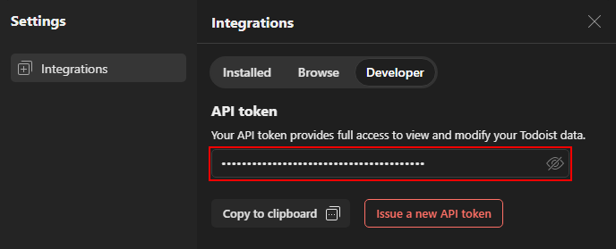
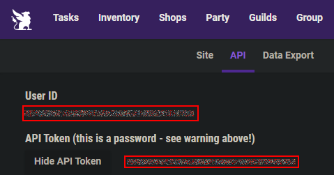
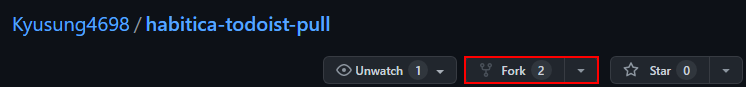
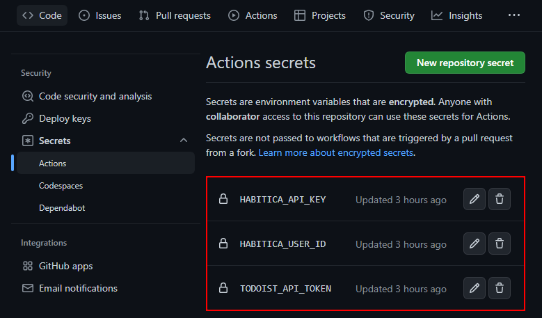
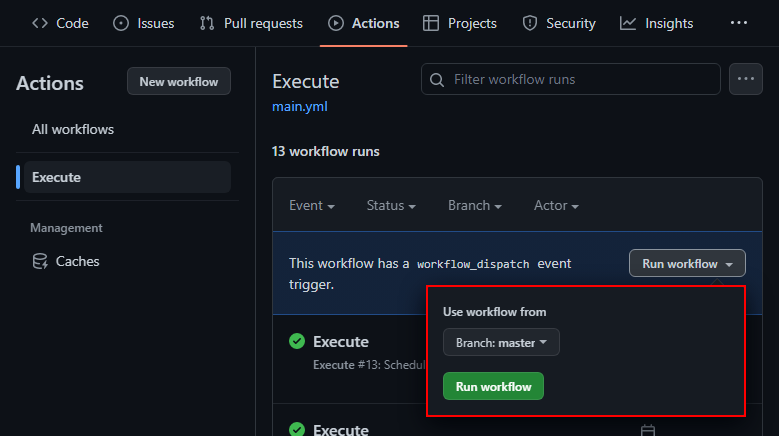

# Habitica _x_ Todoist


## About

A simple script that pulls tasks from [Todoist](https://todoist.com/) and pushes them into [Habitica](https://habitica.com/). Any changes on the Habitica side won't be _pushed_ back. Completing a task in Todoist will also mark it as completed in Habitica.

## Prerequisites

To access both services the script requires your authentication tokens to authorize as you. Please do not share them otherwise. They act like a password! 

### Todoist

Write down your `API Token` from your [Todoist user settings](https://todoist.com/app/settings/integrations/developer). \
\
https://todoist.com/app/settings/integrations/developer

### Habitica

Write down your `User ID` and `API Token` from your [Habitica user settings](https://habitica.com/user/settings/api). \
\
https://habitica.com/user/settings/api

## Run as CLI (NodeJS)

To run this script locally (and manually), you can install it as CLI via npm/yarn/etc.
```bash
npm install -g habitica-todoist-pull
```
_Note: This requires a locally installed version of [NodeJS v18.0+](https://nodejs.org/en/download/)_

### Usage

Can be run from any cmd line tool like this:
```bash
habitica-todoist-pull <todoist_api_token> <habitica_user_id> <habitica_api_token>
```

## Run as CRON job (GitHub Worker)

To run this script periodically you can setup a cron job using GitHub workers. This requires a GitHub account but should be otherwise free. 

1. Fork this repository 
2. Update/create the required action secrets in your repository 
3. Test the workflow by triggering a manual run 